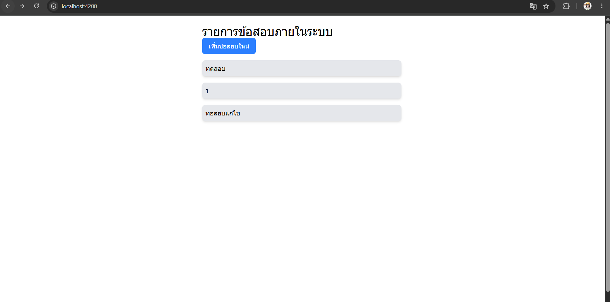
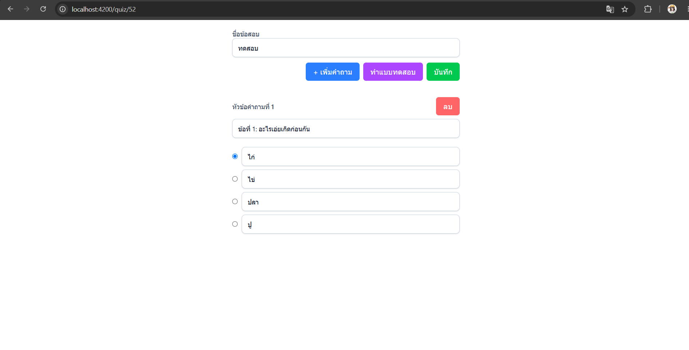
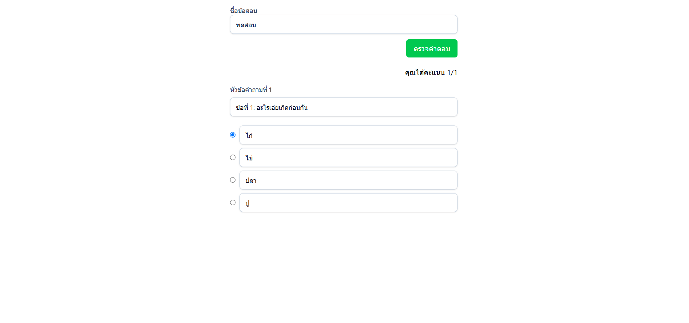

# Interview question (Quiz Service)

## Setup
### Prerequisites
- .NET SDK
- NodeJS
- Angular
- Docker
- Visual Studio 2022
- Visual Studio Code

### 1. Create MySQL Database
For this interview question, MySQL is configured to run using Docker.

You can create the database by running:

    docker run --name local-db \
        -e MYSQL_ROOT_PASSWORD=root \
        -e MYSQL_DATABASE=quizs \
        -p 3306:3306 \
        -d mysql:latest

### 2. Update database
The project includes Entity Framework Core migrations.

Open Package Manager Console in Visual Studio and run:

    Update-Database -Project Infrastructure -StartupProject Presentation

If the database update fails due to migration-related issues, you can recreate the initial migration:

    Add-Migration InitialDb -Project Infrastructure -StartupProject Presentation

Then run:

    Update-Database -Project Infrastructure -StartupProject Presentation

## Features
### 1. Get quiz list

### 2. Create/Update quiz

- You can add multiple question
- You can set one of choice is answer

### 3. Test your quiz
